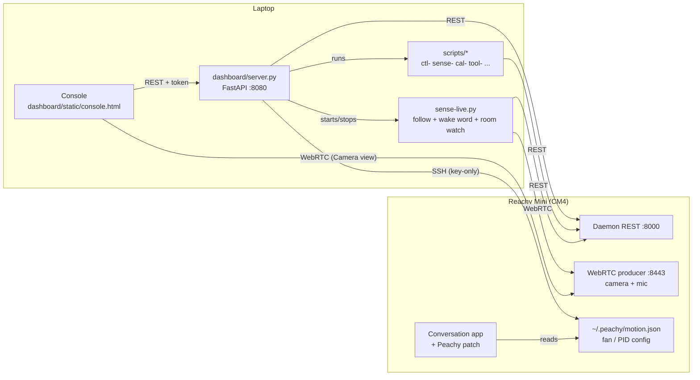

<p align="center"></p>

# Peachy

A desktop console and a set of small tools for a **Reachy Mini Wireless** robot
("Peachy"). Everything runs on a laptop on the same LAN as the robot and talks
to the robot's own daemon — no cloud relay, no Hugging Face login.

This file is the only documentation in the repo. It describes the current
architecture, the console, the robot-side setup, and the rules learned the
hard way.

---

## Architecture



Three channels, each with one job:

| Channel | Used for | Code |
|---|---|---|
| **Daemon REST** `http://<robot>:8000/api/...` | All motion, state, sound playback, volume, app lifecycle | every `ctl-`/`sense-` script, `server.py` |
| **WebRTC** `ws://<robot>:8443` | Camera frames and mic audio (receive-only) | `scripts/rtcmedia.py`, `dashboard/static/rtc.js` |
| **SSH** `<user>@<robot>` (key-only) | Robot-side config only: fan trip point, turntable PID, conversation-app patch, idle-motion settings | `scripts/robotssh.py` |

The console never duplicates logic: every button calls a script or the daemon,
so the scripts stay the single source of truth.

### Repo layout

```
run.sh                  start the console (→ dashboard/run.sh)
peachy                  terminal menu (fallback to the console)
requirements.txt
dashboard/
  server.py             FastAPI backend: /api/* for the console
  run.sh                launcher (token, port, QR, pid file)
  static/console.html   the console (single page, inline CSS/JS)
  static/rtc.js         WebRTC camera client
  static/viz3d/         live 3D twin (three.js + URDF)
  conversation_patch/   peachy_patch.py, installed on the robot by app-patch.sh
  voice_catalog.py, personality_catalog.py, gradio_panel.py (optional)
scripts/                tag-verb tools + importable libs (see Script map)
sounds/portalturret/    short cue clips played on state changes
assets/                 logo sources
tests/                  motion checks against a daemon (real or --sim)
.run/                   runtime state + secrets (git-ignored)
```

---

## Quick start

```bash
python3.12 -m venv reachy_mini_env
source reachy_mini_env/bin/activate
pip install -r requirements.txt

./scripts/net-connect.sh          # find the robot on the LAN, cache it
python scripts/ctl-toggle.py calibrate   # once: record this robot's sleep/wake poses
./run.sh                          # console at http://localhost:8080
```

- `./run.sh` prints a tokenized URL (`?k=<token>`). Open it once; a 90-day
  cookie is set. The token lives in `.run/peachy_token`.
- `./run.sh --restart` replaces a running console; `--qr` prints a QR code.
- Scripts find the robot through `scripts/hostfind.py`:
  `REACHY_HOST` → `.run/reachy_host` cache → LAN probe. No `source` needed.
- If moves stop actuating after a power cycle ("Backend not running"):
  `./scripts/net-connect.sh --fix`, then wait ~45 s.

---

## The console

Single page, desktop layout, black/white liquid-glass style.

| Area | What it does |
|---|---|
| **Header** | Connection status, clocks, System sheet, Stop (abort everything), Shut down. |
| **Robot** | Asleep / Dozing / Awake. State comes from `.run/reachy_toggle_state.json`. |
| **Room watch** | Switch for `sense-live.py --watch`: Light on / Light off and the tucked-camera brightness with its dark/lit lines. Its events go to the activity log. |
| **Follow** | Switch for `sense-live.py --follow` (faces and voices). |
| **Microphone** | Live waveform of the mic array output (20 ms peaks, last 6 s), level in dBFS, and the XVF3800 AGC gain / max. The console opens its own audio-only WebRTC stream while the switch is on and closes it 10 s after polling stops. |
| **Apps** | Installed daemon apps, start/stop; App store (install/remove). |
| **Centre** | Camera (WebRTC, with face boxes) or live 3D twin; below it the **body direction tape** (click to turn, ±160°); beside it the **head tilt tape** (click to tilt, ±30°, up-positive, while Awake). |
| **Moves** | Peachy expressions, daemon emotions and dances, with search. |
| **Conversation** | Start/stop the conversation app, "Hi Peachy" wake-word switch, mute mic, live transcript. |
| **Speaker** | Volume + test, and "type text → Play": `ctl-say.py` speaks it on the robot. |
| **Activity** | Action log (`/api/log`, 200-entry ring buffer), copyable. |
| **System** (sheet) | Health (CPU temperature, fan, response time; the System button shows a dot when it runs hot), heading (how far the base has turned, Recalibrate, Scan the room), 3D view (Reset view), head position on wake, conversation app (personality, voice, idle motion: Breathing, Calmness), portal turret clips, cooling fan, diagnostics. |

Body turn is shown and entered **clockwise-positive** (seen from above). The
robot is counter-clockwise-positive; `/api/body*` does the flip. Head tilt is
shown **up-positive**; the robot's pitch is down-positive. With the patched
conversation app running, the tilt is `head_pitch` in `motion.json`, added on
top of the app's own head motion (so the result wanders a few degrees with it);
otherwise the head goes there directly. Dozing and waking reset it to 0.

### Heading (world degrees)

The body encoder measures the body against the base, and the base turns when
someone bumps it. There is no compass (the IMU is accel + gyro only, on the
body), so the camera is the reference. **Scan the room** (`cal-heading.py
capture`) lifts the head, tilted up 15° so the tabletop, bags and seated people
stay mostly out of the frame, and photographs the room every 20° across the
body's range. Each scan is added (up to 4); later scans are aligned to the
earlier ones by the photos, so they also recalibrate. With two or more scans only
**landmarks** count: features that match between scans taken at different
times. People, bags, chairs and the TV picture move between scans; walls,
ceiling lights, windows and posters don't — so scan at different times of day.
After a bump, **Recalibrate** (`cal-heading.py anchor`) looks at the current
direction and ±15°, and further out (±35°, ±55°) until three views agree within
3° (a view blocked by someone just costs another turn), and stores the median
`world − encoder` in `.run/heading.json`, repeatable to ~1°. Every console angle
(tape, doze direction, room watch, light samples) is then a world angle
(`scripts/heading.py`); motor commands stay within ±160° of the base, so the
reachable part of the tape shifts by the offset. Both run while Dozing with the
lights on; room watch is paused meanwhile. `capture --fresh` forgets the scans
but keeps the world frame; `--fresh --zero` makes the base direction world 0°.

### Dozing (semi-awake)

A cold wake (motors, wake move, conversation app start, backend session) takes
about 30 s. Dozing keeps the conversation app running with its session open,
but with the head tucked and the mic muted, so waking takes a mode switch
instead of a restart. It needs the app patch and a pose calibration.

- **Doze** (`POST /api/do/semi`, ~0.4 s): the console writes
  `{"mode":"tucked", "tucked":…, "lifted":…, "body_yaw":…}` to `~/.peachy/motion.json`
  (tucked = calibrated sleep pose, lifted = head home, body at `PEACHY_DOZE_DEG`).
  The patch glides the head there, mutes the mic, pauses idle behaviours and
  the startup greeting.
- **Wake** (`POST /api/converse/start`, the "Start conversation" button or
  "Hi Peachy"): mode goes back to `free` and the body turns to face front
  (`?keep_body=1` keeps it where it is), the head is up in about 1.5 s and
  Peachy says the fixed greeting (`PEACHY_GREETING`) about 2 s after the request.
- **Look around** (`POST /api/doze/pose`, only while Dozing): head `lifted` /
  `tucked` and/or body `yaw_deg`; `wait` returns once the body is there. Room
  watch uses it.
- In Dozing the wake word stays active, but Follow stays paused.
- Asleep / Awake from Dozing stop the app first, as usual.

### Console API (`dashboard/server.py`)

All routes require the token (cookie, `?k=`, or `X-Peachy-Token` header).

| Area | Routes |
|---|---|
| State | `GET /api/status`, `GET /api/log`, `POST /api/abort`, `POST /api/shutdown` |
| Sleep/wake | `POST /api/do/{wake\|sleep\|toggle\|semi}` (`semi` = Dozing; `POST /api/converse/start` wakes it) |
| Head | `GET /api/head`, `POST /api/head/{move,save,capture,zero}` |
| Body | `GET /api/body`, `POST /api/body/yaw`, `POST /api/body/diag` (angles in world degrees; `/api/body` also has `pitch_deg`) |
| Head tilt | `POST /api/head/pitch {"pitch_deg": up-positive, ±30}` (Awake only) |
| Heading | `GET /api/heading`, `POST /api/heading/anchor`, `POST /api/heading/capture` (Dozing only) |
| Moves | `POST /api/express/{name}`, `GET /api/moves`, `POST /api/moves/play` |
| Speaker | `POST /api/say`, `POST /api/sound/stop`, `GET/POST /api/volume`, `POST /api/volume/test`, `GET /api/sounds/turret`, `POST /api/sounds/turret/sync` |
| Conversation | `GET/POST /api/converse/idle-motion`, `.../voices[/current\|/apply]`, `.../personalities[/apply]` |
| Apps | `GET /api/apps`, `GET /api/apps/store`, `POST /api/apps/{install,stop}`, `POST /api/apps/{start,remove}/{name}`, `GET /api/apps/job/{id}` |
| Senses | `GET /api/sense`, `GET /api/sense/gate`, `POST /api/sense/{follow\|wake\|watch}/{on\|off}`, `POST /api/sense/note` (room watch event → activity log) |
| Microphone | `GET /api/mic?since=<seq>` (min/max/rms per 20 ms, int16; polling keeps the stream open) |
| Dozing | `POST /api/doze/pose` |
| Fan | `GET /api/fan`, `POST /api/fan/{calm,steady,restore}` |
| Camera | `POST /api/snap` (one frame over WebRTC) |

---

## Senses

### Follow and wake word — `scripts/sense-live.py`

Runs on the laptop, fed by one WebRTC stream (video + mic).

- **Follow**: tracks the nearest face (daemon-side tracking on firmware 1.11+,
  else local detection); prefers whoever is talking (mic direction of arrival);
  turns the body toward a voice when nobody is in view.
- **Wake word** ("Hi Peachy"): faster-whisper `base.en`
  (`PEACHY_WAKE_MODEL`, cached under `.run/models/`). Starts the conversation
  app through the console. Any greeting works (hi / hey / hello, which Whisper
  mixes up anyway); the name has to sound more like "Peachy" than "Reachy".

The wake word is guarded against Peachy hearing itself:

1. **Gate.** It only listens when nothing owns the robot (no console action,
   conversation or app per `/api/sense/gate`, no running move) and the speaker is idle
   (`speaking` is false — set by `/api/say`, volume tests and cue clips). After
   any of those ends it needs 4 s of quiet, and the buffered audio is dropped.
2. **Two-pass confirmation.** Whisper tends to echo its `initial_prompt` on
   unclear audio, so a prompted hit must be confirmed by an unprompted pass
   that starts with a greeting word.
3. **No bypass.** If the console declines the wake (HTTP error, e.g. busy), it
   does not wake. Only when the console is unreachable does it start directly.

### Room watch — `sense-live.py --watch`

Runs in the same process and stream as Follow and the wake word. Every robot
action goes through the console, so it needs the console running.

- **Day** (`PEACHY_DAY`, 07:00–23:00): at the start of the day, or when switched
  on during the day, an asleep Peachy goes to Dozing, body at `PEACHY_DOZE_DEG`
  (−100°). If you put it to sleep by hand during the day, it stays asleep
  until the next morning.
- **Lights on**: brightness is the mean luma of the tucked camera view, only
  measured with the body at the doze direction and 3 s after it settles.
  At or below `dark_max` is dark, at or above `lit_min` is lit, and in between
  keeps the last call. A dark→lit change counts only if it rose by `jump`
  within 8 s. A lamp does that in under a second; daylight through the window
  is far slower. The thresholds come from the `dark` and `lit` samples in
  `.run/light_samples/` nearest the doze direction (`cal-light.py`), falling
  back to 30 / 70 / 35.
- **Look around**: head up, then the body steps through `scan_path` (to the far end of ±160°,
  then the near end if the camera hasn't covered it), pausing at each stop. Two face detections
  within 1 s wake Peachy facing that direction (`/api/converse/start?keep_body=1`).
  Nobody around means head down and back to the doze direction.
- **Back to Dozing**: a conversation nobody has spoken to (user speech on the
  app's `/rpc` notifications) for `PEACHY_DOZE_AFTER_S` (180 s) dozes by day
  and sleeps by night.
- **Night**: at 23:00 Dozing or an idle Awake goes to sleep. The wake word
  still works; the conversation goes back to sleep when it goes quiet.

`python scripts/sense-live.py --watch --dry-run` logs readings and decisions
without calling the console.

---

## Robot-side setup (over SSH)

The login user is read from `REACHY_SSH_USER` or `.run/ssh_user` (never
committed). The robot must accept this laptop's key (passwordless sudo). The robot's
OpenSSH penalises failed logins and then refuses every connection for minutes,
so:

- never script password logins;
- always go through `robotssh.ssh_run` / `ssh_argv`. The first auth rejection
  opens a 10-minute breaker (`.run/ssh_block`). Reset:
  `python -c 'import sys; sys.path.insert(0,"scripts"); import robotssh; robotssh.clear_block()'`

| Tool | What it changes | Survives |
|---|---|---|
| `scripts/tool-body-pid.sh apply` | Turntable PID 200/0/0 → 300/50/0 (stock stops 10–15° short). Needs a full `systemctl restart`; REST `/api/daemon/restart` does not reload it. | Reverted by a daemon/firmware update — re-apply |
| `scripts/app-patch.sh apply` | Installs `peachy_patch.py` into the conversation app: holds the body yaw from `~/.peachy/motion.json` (the stock app streams body=0° at 100 Hz), adds the console's head tilt (`head_pitch`), scales breathing, sets the idle-behaviour interval, holds the Dozing poses (`mode` = `free` / `tucked` / `lifted`, with daemon face tracking suspended while held), makes `conversation.say` safe to call over `/rpc`, and overrides the mic chip settings the app writes at start: `mic_ns` (XVF3800 `PP_MIN_NS`, default 0.15 instead of the stock 0.8 — suppresses the room's air-conditioning hum) and `agc_max` (`PP_AGCMAXGAIN`, default 10). `set breath_scale=… idle_every_s=… body_yaw_deg=… mic_ns=… agc_max=…` edits the settings (mic ones apply on the next app start). | Reverted by an app update — re-apply |
| `scripts/tool-fan.sh` | CM4 fan trip point (calm / steady / restore). | — |

Without the app patch, a body turn from the console has to stop the
conversation app first.

---

## Script map

Filenames are `tag-verb`, so `ls scripts/` groups itself.

| Tag | Scripts | Purpose |
|---|---|---|
| `ctl-` | `ctl-toggle.py` (sleep / wake / toggle / calibrate / status), `ctl-express.py` (expressions: yes, no, curious, lookaround, excited, shy, stretch), `ctl-say.py` (text → macOS `say` → robot speaker), `ctl-body-yaw.py` (body-yaw test CLI) | direct control |
| `sense-` | `sense-live.py` | follow + wake word + room watch |
| `cam-` | `cam-snap.py` | one camera frame over WebRTC (`--open`) |
| `cal-` | `cal-head.py`, `cal-light.py`, `cal-heading.py` | neutral head offset (type `save` in the REPL or it doesn't persist); labelled light samples in the Dozing pose (`capture dark\|lit --sweep`, `list`); world heading from the camera (`capture [--fresh [--zero]]`, `anchor [--dry-run]`, `refit`, `status`; `heading.py` is the shared lib) |
| `mic-` | `mic-record.py` | record the mic to `.run/mic/<label>.wav` + stats (levels, bands, tonal peaks, 300–3400 Hz SNR, AGC gain); `--compare noise speech-2m` |
| `diag-` | `diag-yaw.py`, `diag-panel.py` | turntable diagnostic; pre-session smoke test |
| `net-` | `net-connect.sh` | find / revive the robot over REST |
| `app-` | `app-conversation.sh`, `app-patch.sh` | conversation-app lifecycle and patch |
| `tool-` | `tool-body-pid.sh`, `tool-fan.sh`, `tool-qr.py`, `tool-print-links.py`, `tool-stop-all.sh` | robot-side tuning, links, emergency stop |
| lib | `hostfind.py`, `robotssh.py`, `rtcmedia.py`, `sound_sync.py`, `head_pose.py`, `motion_ready.py`, `sleep_gentle.py`, `fan_read.py` | imported by the scripts above — keep importable |

`rtcmedia.py`: one stream per process — each consumer costs the robot an encoder.

---

## Rules learned the hard way

1. **Enable motors before any move.** `play/wake_up`, `goto_sleep` and `goto`
   are silent no-ops while `motor_control_mode` is `disabled`:
   `POST /api/motors/set_mode/enabled` first.
2. **`play/*` moves are asynchronous.** They return a UUID immediately; poll
   `GET /api/move/running` before issuing the next move.
3. **No camera over REST.** Frames and mic come from the WebRTC producer.
4. **Motors-disabled pose is ambiguous** (the head flops under gravity), so
   sleep/wake state lives in `.run/reachy_toggle_state.json`, not in the pose.
5. **Sleep is a tradeoff** (`REACHY_SLEEP_MODE`): `gravcomp` (default) holds
   the pose with a faint hum; `limp` is silent but the head relaxes and the
   antennae rise; `hold` is firmest and loudest.
6. **The whine is the CM4 cooling fan**, not the motors.
7. **Body yaw sign.** Robot/SDK/`goto` are counter-clockwise-positive
   (+ = Peachy's left). The console is clockwise-positive; don't flip twice.
8. **Network.** The school Fortinet intercepts TLS and breaks Tailscale, so
   `tailscaled` is disabled on the robot. Everything needed runs on the LAN.
9. **Daemon face tracking owns the head.** On firmware 1.11+, head tracking
   at weight 1 makes the daemon ignore every head target from apps (antennas
   still move). The conversation app turns it on through its `head_tracking`
   tool. Anything that needs to place the head must stop tracking first.
10. **Stock `conversation.say` drops the session.** The `/rpc` server runs on
    its own event loop and awaits the session websocket from there. The patch
    runs `say` on the session's loop.
11. **`GET /api/apps/list-available/installed` freezes the daemon for ~1 s.**
    It spawns a Python process to scan entry points; meanwhile the state
    stream stops and the SDK marks the connection lost, so apps log
    `Lost connection with the server` and their motion commands are dropped.
    The console caches the list and refreshes it only after install/remove.

---

## Daemon REST cheat sheet

Swagger at `http://<robot>:8000/docs`. Units: metres and radians.

- **Motors**: `POST /api/motors/set_mode/{enabled|disabled|gravity_compensation}`, `GET /api/motors/status`
- **State**: `GET /api/state/full` (head pose, body yaw, antennas, control mode, doa), `GET /api/state/doa` (`angle`, `speech_detected`), `ws://<robot>:8000/api/state/ws/full`
- **Move**: `POST /api/move/play/{wake_up|goto_sleep}`, `POST /api/move/goto`
  `{"head_pose":{x,y,z,roll,pitch,yaw}, "antennas":[l,r], "body_yaw":0, "duration":1.2, "interpolation":"minjerk"}`
  (`duration` required; omitted fields hold), `POST /api/move/set_target` (high-rate), `POST /api/move/stop`, `GET /api/move/running`
- **Media**: `POST /api/media/play_sound` · `stop_sound`, `POST /api/media/sounds/upload`, `DELETE /api/media/sounds/{file}`, `GET/POST /api/volume`
- **Apps**: `GET /api/apps/list-available/installed`, `GET /api/apps/current-app-status`, `POST /api/apps/install`, `POST /api/apps/start-app/{name}`, `POST /api/apps/stop-current-app`, `POST /api/apps/remove/{name}`, `GET /api/apps/job-status/{id}`
- **Daemon**: `POST /api/daemon/restart`

Safety clamps enforced by the daemon: head pitch/roll ±40°, head yaw ±180°,
body yaw ±160°, head-vs-body yaw ≤ 65°.

---

## Configuration

Set in the environment or `.run/reachy.env` (written by `net-connect.sh`).

| Variable | Default | Meaning |
|---|---|---|
| `REACHY_HOST` / `REACHY_PORT` | auto / `8000` | robot daemon |
| `PEACHY_PORT` | `8080` | console port |
| `PEACHY_TOKEN` | `.run/peachy_token` | console access token |
| `REACHY_SLEEP_MODE` | `gravcomp` | `gravcomp` / `limp` / `hold` |
| `PEACHY_WAKE_MODEL` | `base.en` | faster-whisper model for the wake word |
| `PEACHY_CONVO_APP` | `reachy_mini_conversation_app` | app started on wake |
| `PEACHY_GREETING` | `Hi! I'm here.` | line spoken when waking from Dozing |
| `PEACHY_TURRET_CUES` | `1` | play turret clips on state changes |
| `PEACHY_DAY` | `07:00-23:00` | room watch: Dozing inside, asleep outside |
| `PEACHY_DOZE_DEG` | `-100` | body direction while Dozing (clockwise-positive); room watch's light samples are taken here |
| `PEACHY_DOZE_AFTER_S` | `180` | room watch: seconds without user speech before a conversation dozes (night: sleeps) |

`.run/` holds the token, calibration, host cache, logs and models. It is
git-ignored and must never be shared.

---

## Roadmap (v3)

1. **Click to aim.** Click anywhere in the camera view and Peachy turns its body
   and head to centre that point. The pixel becomes a bearing through the
   camera intrinsics (`GET /api/camera/specs` → `K`); yaw is split between body
   and head within the head-vs-body limit (≤ 65°), pitch goes to the head.
2. **3D room capture.** The robot has a single camera (the other "eye" is
   cosmetic), so depth has to come from motion: sweep the head/body through
   known poses (the kinematics give the camera pose for every frame), then fuse
   the frames with monocular depth estimation or structure-from-motion into a
   point cloud or panorama, shown in the console's 3D view.

---

## Extending

- `tag-verb` filenames; resolve the robot with `from hostfind import resolve_host`.
- REST for motion/state, `rtcmedia.py` for camera/audio, `robotssh` for
  robot-side config only.
- Enable motors before moving; wait for `play/*` moves to finish.
- Give anything autonomous a `--dry-run`.
- New console features call a script or the daemon; don't duplicate logic in
  `server.py`.
- Anything that polls robot state goes through `_daemon_get` in `server.py`
  (one shared request per path per second for all tabs and `sense-live`).
  Laptop-side scripts ask the console (`/api/sense/gate`, `/api/status`)
  instead of polling the daemon themselves. The robot is a CM4 under load.
