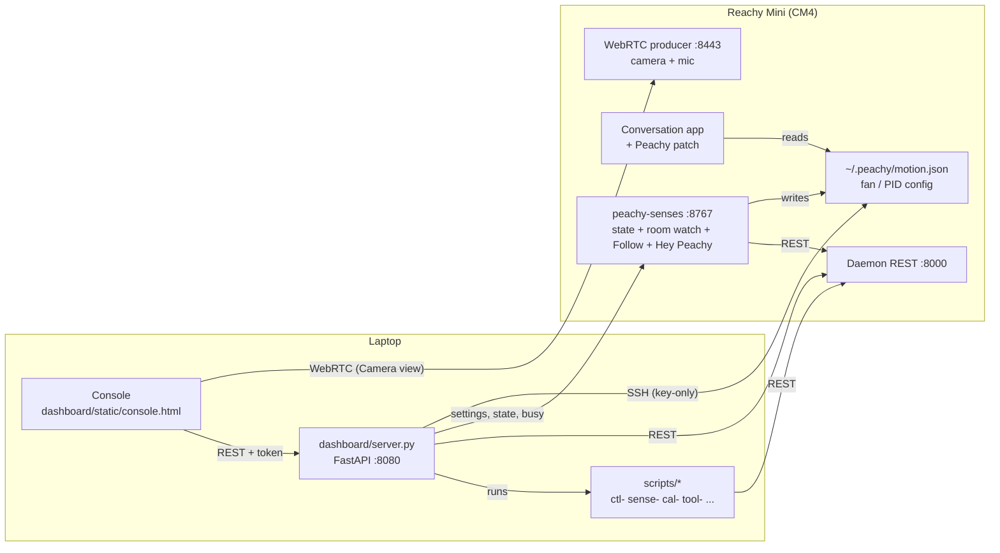

<p align="center"></p>

# Peachy

A desktop console and a set of small tools for a **Reachy Mini Wireless** robot
("Peachy"). Everything runs on a laptop on the same LAN as the robot and talks
to the robot's own daemon — no cloud relay, no Hugging Face login.

This file is the only documentation in the repo. It describes the current
architecture, the console, the robot-side setup, and the rules learned the
hard way.

---

## Architecture



Three channels, each with one job:

| Channel | Used for | Code |
|---|---|---|
| **Daemon REST** `http://<robot>:8000/api/...` | All motion, state, sound playback, volume, app lifecycle | every `ctl-`/`sense-` script, `server.py` |
| **WebRTC** `ws://<robot>:8443` | Camera frames and mic audio (receive-only) | `scripts/rtcmedia.py`, `dashboard/static/rtc.js` |
| **SSH** `<user>@<robot>` (key-only) | Robot-side config only: fan trip point, turntable PID, conversation-app patch, idle-motion settings, installing `peachy-senses` | `scripts/robotssh.py` |
| **Senses** `http://<robot>:8767` | The console pushes settings, its state changes and a busy flag to the robot's routine, and reads its status and events | `robot/peachy_senses.py`, `server.py` |

The console never duplicates logic: every button calls a script or the daemon,
so the scripts stay the single source of truth.

### Repo layout

```
run.sh                  start the console (→ dashboard/run.sh)
peachy                  terminal menu (fallback to the console)
requirements.txt
dashboard/
  server.py             FastAPI backend: /api/* for the console
  run.sh                launcher (token, port, QR, pid file)
  static/console.html   the console (single page, inline CSS/JS)
  static/rtc.js         WebRTC camera client
  static/viz3d/         live 3D twin (three.js + URDF)
  conversation_patch/   peachy_patch.py, installed on the robot by app-patch.sh
  voice_catalog.py, personality_catalog.py, gradio_panel.py (optional)
scripts/                tag-verb tools + importable libs (see Script map)
airpods/                PeachyHead.app source: AirPods head motion → JSON lines (see AirPods head follow)
sounds/portalturret/    short cue clips played on state changes
assets/                 logo sources
tests/                  motion checks against a daemon (real or --sim)
.run/                   runtime state + secrets (git-ignored)
```

---

## Quick start

```bash
python3.12 -m venv reachy_mini_env
source reachy_mini_env/bin/activate
pip install -r requirements.txt

./scripts/net-connect.sh          # find the robot on the LAN, cache it
python scripts/ctl-toggle.py calibrate   # once: record this robot's sleep/wake poses
./run.sh                          # console at http://localhost:8080
```

- `./run.sh` prints a tokenized URL (`?k=<token>`). Open it once; a 90-day
  cookie is set. The token lives in `.run/peachy_token`.
- `./run.sh --restart` replaces a running console; `--qr` prints a QR code.
- Scripts find the robot through `scripts/hostfind.py`:
  `REACHY_HOST` → `.run/reachy_host` cache → LAN probe. No `source` needed.
- If moves stop actuating after a power cycle ("Backend not running"):
  `./scripts/net-connect.sh --fix`, then wait ~45 s.

---

## The console

Single page, desktop layout, black/white liquid-glass style.

| Area | What it does |
|---|---|
| **Header** | Connection status, clocks, System sheet, Stop (abort everything), Shut down. |
| **Robot** | Asleep / Dozing / Awake. State comes from `.run/reachy_toggle_state.json`. Asleep faces the Dozing direction (`PEACHY_DOZE_DEG`, −100°): the body turns there with the head, then the droop; Awake brings it back to body 0 before `wake_up`, which ends there anyway in a move timed for the head. |
| **Room watch** | Switch for room watch on the robot: Light on / Light off and the tucked-camera brightness with its dark/lit lines. Its events go to the activity log. |
| **Follow** | Switch for Follow on the robot (faces). |
| **Avatar** | Switch: Peachy becomes your avatar. Its head copies yours from the AirPods on this Mac (all three axes), your voice (this Mac's mic) plays on its speaker, its mic plays in your AirPods. Recenter, Set level, live readout. See Avatar. |
| **Hey Peachy** | Switch for the wake word on the robot: Listening, Heard, or why it's paused. |
| **Microphone** | Live waveform of the mic array output (20 ms peaks, last 6 s), level in dBFS, and the XVF3800 AGC gain / max. The console opens its own audio-only WebRTC stream while the switch is on and closes it 10 s after polling stops. |
| **Apps** | Installed daemon apps, start/stop; App store (install/remove). |
| **Centre** | Camera (WebRTC, with face boxes) or live 3D twin; below it the **body direction tape** (click to turn, ±160°); beside it the **head tilt tape** (click to tilt, ±30°, up-positive, while Awake). |
| **Moves** | Peachy expressions, daemon emotions and dances, with search. |
| **Conversation** | Start/stop the conversation app, mute mic, live transcript. |
| **Speaker** | Volume + test, and "type text → Play": `ctl-say.py` speaks it on the robot. |
| **Activity** | Action log (`/api/log`, 200-entry ring buffer), copyable. |
| **System** (sheet) | Health (CPU temperature, fan, response time; the System button shows a dot when it runs hot), heading (how far the base has turned, Recalibrate, Scan the room), 3D view (Reset view), head position on wake, conversation app (personality, voice, idle motion: Breathing, Calmness), portal turret clips, cooling fan, diagnostics. |

Body turn is shown and entered **clockwise-positive** (seen from above). The
robot is counter-clockwise-positive; `/api/body*` does the flip. Head tilt is
shown **up-positive**; the robot's pitch is down-positive. With the patched
conversation app running, the tilt is `head_pitch` in `motion.json`, added on
top of the app's own head motion (so the result wanders a few degrees with it);
otherwise the head goes there directly. Dozing and waking reset it to 0.

**Alt-azimuth.** Everything Peachy does on its own turns (body + head yaw) and
tilts (head pitch), and never rolls: Follow, voice turns, room watch, the tapes,
waking and Dozing poses, and the conversation app's face tracking (the patch
aims it). Head poses are extrinsic xyz, R = Rz(yaw)·Ry(pitch)·Rx(roll),
so holding roll fixed keeps the horizon level (`head_pose.altaz`). Roll and head
position are home's: 0 unless a home is saved under "Head position on wake".
Only moves (Peachy expressions, emotions, dances), the conversation app's own
head motion while talking (speech wobble, breathing) and the avatar's head
sync roll the head.

### Heading (world degrees)

The body encoder measures the body against the base, and the base turns when
someone bumps it. There is no compass (the IMU is accel + gyro only, on the
body), so the camera is the reference. **Scan the room** (`cal-heading.py
capture`) lifts the head, tilted up 15° so the tabletop, bags and seated people
stay mostly out of the frame, and photographs the room every 20° across the
body's range. Each scan is added (up to 4); later scans are aligned to the
earlier ones by the photos, so they also recalibrate. With two or more scans only
**landmarks** count: features that match between scans taken at different
times. People, bags, chairs and the TV picture move between scans; walls,
ceiling lights, windows and posters don't — so scan at different times of day.
After a bump, **Recalibrate** (`cal-heading.py anchor`) looks at the current
direction and ±15°, and further out (±35°, ±55°) until three views agree within
3° (a view blocked by someone just costs another turn), and stores the median
`world − encoder` in `.run/heading.json`, repeatable to ~1°. Every console angle
(tape, doze direction, room watch, light samples) is then a world angle
(`scripts/heading.py`); motor commands stay within ±160° of the base, so the
reachable part of the tape shifts by the offset. Both run while Dozing with the
lights on; room watch is paused meanwhile. `capture --fresh` forgets the scans
but keeps the world frame; `--fresh --zero` makes the base direction world 0°.

### Dozing (semi-awake)

A cold wake (motors, wake move, conversation app start, backend session) takes
about 30 s. Dozing keeps the conversation app running with its session open,
but with the head tucked and the mic muted, so waking takes a mode switch
instead of a restart. It needs the app patch and a pose calibration.

- **Doze** (`POST /api/do/semi`, ~0.4 s): the console writes
  `{"mode":"tucked", "tucked":…, "lifted":…, "body_yaw":…}` to `~/.peachy/motion.json`
  (tucked = calibrated sleep pose, lifted = head home, body at `PEACHY_DOZE_DEG`).
  The patch glides the head there, mutes the mic, pauses idle behaviours and
  the startup greeting.
- **Wake** (`POST /api/converse/start`, the "Start conversation" button,
  room watch finding someone, or "Hey Peachy"): mode goes back to `free` and the body turns to face front
  (`?keep_body=1` keeps it where it is), the head is up in about 1.5 s and
  Peachy says the fixed greeting (`PEACHY_GREETING`) about 2 s after the request.
- **Look around** (`POST /api/doze/pose`, only while Dozing): head `lifted` /
  `tucked` and/or body `yaw_deg`; `wait` returns once the body is there. Room
  watch on the robot writes `motion.json` itself instead.
- In Dozing Follow stays paused.
- Asleep / Awake from Dozing stop the app first, as usual.

### Console API (`dashboard/server.py`)

All routes require the token (cookie, `?k=`, or `X-Peachy-Token` header).

| Area | Routes |
|---|---|
| State | `GET /api/status`, `GET /api/log`, `POST /api/abort`, `POST /api/shutdown` |
| Sleep/wake | `POST /api/do/{wake\|sleep\|toggle\|semi}` (`semi` = Dozing; `POST /api/converse/start` wakes it) |
| Head | `GET /api/head`, `POST /api/head/{move,save,capture,zero}` |
| Body | `GET /api/body`, `POST /api/body/yaw`, `POST /api/body/diag` (angles in world degrees; `/api/body` also has `pitch_deg`) |
| Head tilt | `POST /api/head/pitch {"pitch_deg": up-positive, ±30}` (Awake only) |
| Heading | `GET /api/heading`, `POST /api/heading/anchor`, `POST /api/heading/capture` (Dozing only) |
| Moves | `POST /api/express/{name}`, `GET /api/moves`, `POST /api/moves/play` |
| Speaker | `POST /api/say`, `POST /api/sound/stop`, `GET/POST /api/volume`, `POST /api/volume/test`, `GET /api/sounds/turret`, `POST /api/sounds/turret/sync` |
| Conversation | `GET/POST /api/converse/idle-motion`, `.../voices[/current\|/apply]`, `.../personalities[/apply]` |
| Apps | `GET /api/apps`, `GET /api/apps/store`, `POST /api/apps/{install,stop}`, `POST /api/apps/{start,remove}/{name}`, `GET /api/apps/job/{id}` |
| Senses | `GET /api/sense`, `POST /api/sense/{follow\|watch\|wake}/{on\|off}` (the robot's routine; see Senses) |
| Avatar | `GET /api/airpods`, `POST /api/airpods/{on\|off\|recenter\|level}` (see Avatar) |
| Microphone | `GET /api/mic?since=<seq>` (min/max/rms per 20 ms, int16; polling keeps the stream open) |
| Dozing | `POST /api/doze/pose` |
| Fan | `GET /api/fan`, `POST /api/fan/{calm,steady,restore}` |
| Camera | `POST /api/snap` (one frame over WebRTC) |

---

## Senses

All of it runs on the robot: `robot/peachy_senses.py`, the systemd unit
`peachy-senses` (apps venv, normal priority), installed by
`scripts/sense-robot.sh install`. It keeps working with the laptop off.
"Hey Peachy", a face found by room watch, or the console wakes Peachy.

- **State** (asleep / semi = Dozing / awake) lives on the robot in
  `~/.peachy/state.json`. The console reports its own actions (`/state`,
  also from `ctl-toggle.py`) and reads the state back from there.
- **Settings** (`~/.peachy/senses.json`) are built on the laptop by
  `scripts/senses_cfg.py` from its calibration (world heading, head home,
  Dozing and sleep poses, light samples) and pushed by the console whenever
  they change; the robot keeps the last copy. The console's Follow, Room
  watch and Hey Peachy switches set `follow` / `watch` / `wake`; Stop and Shut
  down turn all three off.
- **Holding off**: while the console holds its robot lock (any button that
  moves Peachy) it tells the robot (`/busy`, refreshed every 60 s, 180 s ttl),
  and room watch, Follow and the wake word pause. Robot events (dozing, lights on, someone
  found, asleep…) are copied into the console's activity log.
- **Faces**: YuNet on the daemon's camera over IPC, 320 px wide, 10 times a
  second, only while following or looking around (about 95 ms per frame
  including the 1080p resize, roughly 80% of one of the CM4's four cores).
  Otherwise the service idles at about 5% of a core; the camera closes 20 s
  after the last use.
- The HTTP side (`:8767`): `GET /status` is open; `POST /config`, `/state`,
  `/busy` need the token from `.run/senses_token` (made by `sense-robot.sh`,
  never committed).

### Follow

Awake with no app running (no conversation, nothing in Dozing), Peachy follows
the nearest face alt-azimuth through the local daemon (yaw and pitch eased at
25 Hz, roll and position held at `head_pose.altaz`'s level); the body takes over
past 18°, and whoever is talking wins when several faces are in view. It
doesn't turn toward voices: the mic array flags Peachy's own motor noise as
speech, from straight left or right (direction of arrival 0 or π), so each
turn set off the next. Losing the
face holds the pose; after 6 s it lets go where it is. It pauses when motors are
off, an app or move is running, the console is acting, or someone else moves the
head (4 s).

While the conversation app runs, its `head_tracking` tool is handled by the app
patch instead (see `app-patch.sh`).

### Room watch

- **Day** (`PEACHY_DAY`, 07:00–23:00): at the start of the day, or when switched
  on during the day, an asleep Peachy goes to Dozing, body at `PEACHY_DOZE_DEG`
  (−100°). If you put it to sleep by hand during the day, it stays asleep
  until the next morning. If the conversation app disappears while Dozing, it
  is restarted after 30 s.
- **Lights on**: brightness is the mean luma of the tucked camera view (camera
  over IPC; within 2% of the WebRTC view the samples were taken from, after 2 s
  of auto-exposure), only measured with the body at the doze direction and 3 s
  after it settles. At or below `dark_max` is dark, at or above `lit_min` is
  lit, and in between keeps the last call. A dark→lit change counts only if it
  rose by `jump` within 8 s. A lamp does that in under a second; daylight
  through the window is far slower. The thresholds come from the `dark` and
  `lit` samples in `.run/light_samples/` nearest the doze direction
  (`cal-light.py`), falling back to 30 / 70 / 35.
- **Look around**: head up, then the body steps through `scan_path` (to the far
  end of ±160°, then the near end if the camera hasn't covered it), pausing at
  each stop. Two face detections within 1 s wake Peachy facing that direction,
  with the greeting. Nobody around means head down and back to the doze
  direction.
- **Back to Dozing**: a conversation nobody has spoken to (user speech on the
  app's `/rpc` notifications) for `PEACHY_DOZE_AFTER_S` (180 s) dozes by day
  and sleeps by night.
- **Night**: at 23:00 Dozing or an idle Awake goes to sleep: app off (waiting
  out the daemon's own reset, then stopping its moves), body to the doze
  direction, a 2.8 s droop to the calibrated sleep pose, snore, motors off (the
  laptop's version also plays a farewell line from the turret pack). Day and
  night use the robot's clock, set to America/New_York
  (`sudo timedatectl set-timezone …`).
- **Keeping it right**: every loop compares the state with the one the time of
  day wants (Dozing by day, asleep by night) and fixes it, retrying a failed
  change after 60 s. A state set by hand (Console, wake word) is held until the
  next day/night change. Awake with no app, no face in the last 2 s and nobody
  using the Console for `PEACHY_DOZE_AFTER_S` dozes by day and sleeps by night.
  Awake or Dozing with motors off for 10 s and no app becomes asleep (the
  daemon's idle reset got there first).
- **Health**: Dozing is refused while the conversation app patch is missing
  (an app update removes it; rerun `scripts/app-patch.sh`), and asleep is used
  instead. A running conversation app whose `/rpc` has been unreachable for
  5 min is restarted while Dozing. Failures go to the event log and, if
  `PEACHY_NOTIFY_URL` is set (for example `https://ntfy.sh/<topic>`), are
  POSTed there, each message at most every 30 min.

### Hey Peachy

"Hey Peachy" (or "Hi Peachy") wakes Peachy into a conversation from asleep,
Dozing, or Awake with no app, then turns the body toward the voice (mic
direction of arrival). From asleep it plays the wake-up move first. It listens
only while nothing else has the robot and after 4 s of that, so it never hears
Peachy's own voice, sounds or moves; during a conversation, an app, a move, a
look-around or a console action the mic is closed and nothing runs. The robot's
own speaker output is removed by the mic array's echo canceller anyway.

- **Detector**: openWakeWord's three ONNX models (melspectrogram → Google speech
  embedding → the `hey_peachy.onnx` classifier), run by `robot/peachy_wake.py`
  (`~/.peachy/wake.py`) on the shared ALSA capture device (`dsnoop`, 16 kHz), so
  it runs alongside the conversation app. One 80 ms frame at or over
  `wake_threshold` (0.7) triggers it (the score peaks for about one frame);
  then 8 s cooldown.
- **Cost**: the speech embedding is most of it (about 18 ms per 80 ms frame on
  the CM4), so it only runs while the room isn't quiet: a frame louder than 3×
  the 300–3400 Hz noise floor switches the models on for 2 s, first rebuilding
  the last 0.9 s from the raw audio so the start of the phrase isn't lost. In a
  quiet room that is about 4% of one core; while people talk about 25%.
- **Model**: `robot/models/hey_peachy.onnx`, trained with openWakeWord's
  automatic training on synthetic Piper voices (see "Training the wake word").

### Training the wake word

The model was trained on the laptop (M-series Mac, a few hours, most of it
generating and augmenting clips; the training itself takes 5 minutes) outside
the repo, in `~/peachy-train`, with openWakeWord's `train.py`:

- Positives: 25,000 Piper (`en_US-libritts_r-medium`) clips of "hey peachie" /
  "hi peachie" — espeak reads "peachy" as /piːki/, the `-ie` spelling gives
  /piːtʃi/ — plus 6,000 with a pause ("hey, peachie", "hey peachie!").
  Negatives: 25,000 clips of phonetically close phrases, plus 8,000 hard
  negatives as their own class ("hey peach", "hey Petey", "hey Reachy" as both
  /ɹiːki/ and /ɹiːtʃi/, "peaches", "hey Richie", other assistants' wake words).
  `train.py` alone mixes such a list into the 25,000 texts round-robin, so each
  phrase lands in about one clip and "hey peach" still woke it.
- Augmentation: MIT impulse responses, ESC-50, two AudioSet shards, and 10
  minutes recorded through the robot's own mic in its room.
- Negative features: openWakeWord's precomputed ACAV100M set (~2,000 h, 17 GB)
  and its 11 h validation set for the false-positive rate.
- Local fixes in a wrapper: Piper on the GPU (MPS, TorchScript fusion off),
  adversarial phrases built from "peachy" (the DeepPhonemizer download for
  out-of-dictionary words is gone), and fork instead of spawn for the training
  data loader on macOS.
- Checked with macOS voices (a TTS engine it never saw) and a real recording:
  a person saying "Hi Peachy" scores 0.99; about half of the macOS voice clips
  trigger it (voices like Albert or Ralph never do); 5 of 252 near-miss clips
  do ("hey Petey", "that's peachy"); 7 minutes of room audio, none.

`./scripts/sense-robot.sh status` shows the live state; `log` shows its journal.

---

## Avatar

`scripts/ctl-avatar.py`: Peachy stands in for you somewhere else. Its head
moves with yours (AirPods head follow, below), your voice from this Mac's
built-in mic plays on its speaker, and what its mic hears plays in your
AirPods. Nothing else runs meanwhile, the conversation included.

```bash
./scripts/avatar-robot.sh install     # once: the robot half (status / uninstall)
python scripts/ctl-avatar.py          # q or Ctrl-C to stop; --no-audio = head only
```

- **Robot half**: `robot/peachy_avatar`, a Reachy Mini app (entry point
  `reachy_mini_apps: peachy_avatar`) that `avatar-robot.sh` copies with a
  minimal dist-info into `/venvs/apps_venv`, where the daemon lists installed
  apps. It moves nothing: it holds the daemon's app slot (with no app running,
  the daemon puts the robot to sleep 1.5 s after the last app stops), turns
  the motors on, marks Peachy awake and keeps peachy-senses `/busy` set, so
  room watch, Follow and the wake word stay paused. It does not create a
  `ReachyMini`: that one's `no_media` mode makes the daemon release the camera
  and audio, which ends the daemon's WebRTC and with it the avatar's audio.
- **Start**: `ctl-avatar.py` stops the running app and starts `peachy_avatar`
  right after the stop request returns (it returns after the daemon's 1 s
  return-to-zero), inside the daemon's 1.5 s grace, so Peachy never starts
  its sleep. Measured: 90 ms between the conversation app's release and the
  avatar's acquire. Starting before the stop returns would let the daemon's
  stop path clear its record of the new app.
- **Audio** (`avatar_audio.py`): one WebRTC consumer of the daemon's producer
  (`ws://<robot>:8443`), answered sendrecv. The robot mic's Opus goes to this
  Mac's default output through a 60 ms jitter buffer (webrtcbin's default is
  200); the built-in mic, picked by CoreAudio id so the AirPods stay in their
  high-quality output profile, goes out as 16 kHz stereo Opus (low delay,
  10 ms frames, in-band FEC) on the audio track the daemon offers. The daemon
  plays it on the speaker and uses it as the echo reference for the robot
  mic. It reconnects every 3 s if the link drops. `--mic NAME` picks another
  input, `--volume` sets Peachy's mic on this Mac. With the Mac speakers as
  output instead of AirPods, the two mics feed back.
- **Stop**: the head glides home, the app stops, and Peachy stays Awake with
  the head at home, so Follow takes over. The daemon would put it to sleep
  1.5 s after the app exits, but any message on its WebRTC data channel calls
  that off, so the audio link sends `get_version` every 0.2 s from before the
  stop until 2 s after it returns (`--no-audio` still opens the link, silent).
  A LAN session never takes the app slot, so this holds nothing. If the link
  is down, the daemon's sleep goes ahead and the console shows Asleep.

**Console**: the Avatar switch (under Follow) runs `ctl-avatar.py
--status-file .run/airpods_status.json` (output in `.run/airpods.log`). While
it is on, the session holds the console's robot lock, so every other motion
control is greyed out. Stop and Shut down end it too. **Recenter** makes the
way you face now straight ahead (SIGUSR1); **Set level** calibrates the buds'
tilt (SIGUSR2, see Mapping). The card shows what is sent (head yaw relative to
the body, pitch, roll), the body, the AirPods→send rates, sample age,
transport and the audio link. On start the console ends a session left over
from a console that went away.

## AirPods head follow

`scripts/ctl-airpods.py`: Peachy's head copies yours while you wear AirPods
(Pro, Max, 3rd gen) connected to this Mac. Same direction: you turn to your
left, Peachy turns to its left. All three axes, yaw, pitch and roll, and not
alt-azimuth: this is teleoperation, so it rolls the head. The avatar runs it
(`keep_app`: the avatar's own app stays running); on its own:

```bash
python scripts/ctl-airpods.py --probe     # AirPods only, check the axes
python scripts/ctl-airpods.py --dry-run   # full pipeline, nothing sent
python scripts/ctl-airpods.py             # follow (--stop-app stops a running app first)
```

- **Reader**: `airpods/` builds `.run/airpods/PeachyHead.app` (`airpods/build.sh`,
  run automatically when the source is newer). It streams CoreMotion's
  `CMHeadphoneMotionManager` attitude as JSON lines (quaternion, about 50 Hz,
  15-40 ms old). macOS 14+. macOS asks once for Motion & Fitness access for
  PeachyHead; if it was refused, turn it on under System Settings > Privacy &
  Security > Motion & Fitness. The app re-spawns itself "disclaimed", because
  macOS otherwise charges the permission to the terminal or editor that
  started it and kills it. A fresh stream (start, AirPods back in) opens with
  about 100 ms of a cached pose, up to 15 s old, before it jumps to the real
  one, so the first 0.3 s are skipped.
- **Mapping**: CoreMotion's headphone attitude has z vertical. Pitch and roll
  are absolute, against gravity: hold your head level and Peachy's is level,
  whatever pose you start in (no need to straighten up first). Yaw has no
  reference (AirPods have no compass) and starts at 0 with each stream, so the
  direction you face at the start (or on `c` / Recenter) is straight ahead.
  It drifts slowly; recenter now and then. Absolute means your real head
  angle: looking down at the laptop (to flip the switch) or at Peachy on the
  desk makes Peachy look down too, typically 10-25°. **Set level** (`l` in a
  terminal, SIGUSR2) removes how the buds sit in your ears. After a 3 s
  countdown to look up from the screen, the buds' average tilt over 1 s, taken
  with your head level at the horizon, is saved to `.run/airpods_level.json`.
  It is applied as a fixed rotation (buds→head) on every later session, so
  combined turns stay exact. Redo it if you wear the buds differently. The
  attitude goes from the AirPods
  frame (x right ear, y nose, z up) to the head frame (x forward, y left, z up)
  and is split into the daemon's extrinsic xyz angles. `--relative-tilt` makes
  pitch and roll relative to the recentered pose, added to home's, instead.
  `--flip yaw,pitch,roll` inverts axes (`--flip yaw` alone gives a mirror).
  Pitch and roll clamp at ±35°. Past 55° of
  head yaw the body turntable takes the rest (≤ 120°/s, ±160°); `--no-body`
  holds the body and clamps head yaw at 63°.
- **Latency**: a One Euro filter (`--smooth`, 0 = raw), optional prediction from
  head speed (`--lead 40` = 40 ms ahead). Targets go out on the daemon's
  `/api/move/ws/set_target` websocket, which has no per-target reply, so Wi-Fi
  round trips (30 ms median, spikes of 800 ms) don't hold anything up. A
  sender thread always sends the newest target, and falls back to keep-alive
  `POST /api/move/set_target` if the socket fails.
- **Safety**: it refuses to run while an app is running (the conversation app
  streams its own head targets) unless `--stop-app`. It glides the head home
  first, and keeps peachy-senses `/busy` set (every 5 s, 20 s ttl) so Follow
  and room watch pause. With the AirPods out (or disconnected) it holds for
  2 s, then glides home; putting them back recenters. The start, recenter,
  resume and reconnect blend in over 0.6 s. If the daemon keeps reporting a
  stopped app as `stopping` (its process already gone), it notes that and
  goes on. That state also blocks every app start until
  `sudo systemctl restart reachy-mini-daemon`; REST `/api/daemon/restart`
  doesn't clear it. Quitting (`q`, Ctrl-C, SIGTERM) glides head
  and body back to where they started.
- **Keys**: `c` recenter, `space` pause/resume, `q` quit. The status line shows
  your head as sent, the body, AirPods→send rates, sample age and send time.

---

## Robot-side setup (over SSH)

The login user is read from `REACHY_SSH_USER` or `.run/ssh_user` (never
committed). The robot must accept this laptop's key (passwordless sudo). The robot's
OpenSSH penalises failed logins and then refuses every connection for minutes,
so:

- never script password logins;
- always go through `robotssh.ssh_run` / `ssh_argv`. The first auth rejection
  opens a 10-minute breaker (`.run/ssh_block`). Reset:
  `python -c 'import sys; sys.path.insert(0,"scripts"); import robotssh; robotssh.clear_block()'`

| Tool | What it changes | Survives |
|---|---|---|
| `scripts/tool-body-pid.sh apply` | Turntable PID 200/0/0 → 300/50/0 (stock stops 10–15° short). Needs a full `systemctl restart`; REST `/api/daemon/restart` does not reload it. | Reverted by a daemon/firmware update — re-apply |
| `scripts/app-patch.sh apply` | Installs `peachy_patch.py` into the conversation app: holds the body yaw from `~/.peachy/motion.json` (the stock app streams body=0° at 100 Hz), adds the console's head tilt (`head_pitch`), scales breathing, sets the idle-behaviour interval, holds the Dozing poses (`mode` = `free` / `tucked` / `lifted`; Dozing turns face tracking off and forgets the request), aims the app's face tracking alt-azimuth (the daemon tracker stays off; while the app's `head_tracking` tool is on, the patch runs YuNet itself on the app's camera frames, 320 px wide, 10 times a second at normal priority, about 40-55 ms per frame on the CM4; it turns the head by yaw and pitch and the body follows past 18°; turning the body from the console or Dozing ends it), makes `conversation.say` safe to call over `/rpc`, and overrides the mic chip settings the app writes at start: `mic_ns` (XVF3800 `PP_MIN_NS`, default 0.15 instead of the stock 0.8 — suppresses the room's air-conditioning hum) and `agc_max` (`PP_AGCMAXGAIN`, default 10). `set breath_scale=… idle_every_s=… body_yaw_deg=… mic_ns=… agc_max=…` edits the settings (mic ones apply on the next app start). | Reverted by an app update — re-apply |
| `scripts/sense-robot.sh install` | Installs `robot/peachy_senses.py` as the systemd unit `peachy-senses` (apps venv, normal priority): state, room watch, Follow and the wake word on the robot (see Senses), with `robot/peachy_wake.py`, `robot/models/*.onnx` and openWakeWord's two feature models (downloaded once into `.run/models/oww`), plus the token in `.run/senses_token`. Replaces the older `peachy-follow` unit. `status`, `log`, `uninstall`. | Survives reboots and app updates |
| `scripts/tool-fan.sh` | CM4 fan trip point (calm / steady / restore). | — |

Without the app patch, a body turn from the console has to stop the
conversation app first.

---

## Script map

Filenames are `tag-verb`, so `ls scripts/` groups itself.

| Tag | Scripts | Purpose |
|---|---|---|
| `ctl-` | `ctl-toggle.py` (sleep / wake / toggle / calibrate / status), `ctl-express.py` (expressions: yes, no, curious, lookaround, excited, shy, stretch), `ctl-say.py` (text → macOS `say` → robot speaker), `ctl-body-yaw.py` (body-yaw test CLI), `ctl-airpods.py` (head follows your AirPods: `--probe`, `--dry-run`, `--stop-app`), `ctl-avatar.py` (Peachy as your avatar: head + two-way audio; `--no-audio`, `--mic`, `--volume`) | direct control |
| `avatar-` | `avatar-robot.sh` (+ `robot/peachy_avatar`) | installs the avatar's robot app (`status`, `install`, `uninstall`) |
| `sense-` | `sense-robot.sh` (+ `senses_cfg.py`, `robot/peachy_senses.py`, `robot/peachy_wake.py`) | installs state, room watch, Follow and the wake word on the robot; the settings pushed to it |
| `cam-` | `cam-snap.py` | one camera frame over WebRTC (`--open`) |
| `cal-` | `cal-head.py`, `cal-light.py`, `cal-heading.py` | neutral head offset (type `save` in the REPL or it doesn't persist); labelled light samples in the Dozing pose (`capture dark\|lit --sweep`, `list`); world heading from the camera (`capture [--fresh [--zero]]`, `anchor [--dry-run]`, `refit`, `status`; `heading.py` is the shared lib) |
| `mic-` | `mic-record.py` | record the mic to `.run/mic/<label>.wav` + stats (levels, bands, tonal peaks, 300–3400 Hz SNR, AGC gain); `--compare noise speech-2m` |
| `diag-` | `diag-yaw.py`, `diag-panel.py` | turntable diagnostic; pre-session smoke test |
| `net-` | `net-connect.sh` | find / revive the robot over REST |
| `app-` | `app-conversation.sh`, `app-patch.sh` | conversation-app lifecycle and patch |
| `tool-` | `tool-body-pid.sh`, `tool-fan.sh`, `tool-qr.py`, `tool-print-links.py`, `tool-stop-all.sh` | robot-side tuning, links, emergency stop |
| lib | `hostfind.py`, `robotssh.py`, `rtcmedia.py`, `sound_sync.py`, `head_pose.py`, `motion_ready.py`, `sleep_gentle.py`, `fan_read.py`, `avatar_audio.py` | imported by the scripts above — keep importable |

`rtcmedia.py`: one stream per process — each consumer costs the robot an encoder.

---

## Rules learned the hard way

1. **Enable motors before any move.** `play/wake_up`, `goto_sleep` and `goto`
   are silent no-ops while `motor_control_mode` is `disabled`:
   `POST /api/motors/set_mode/enabled` first.
2. **`play/*` moves are asynchronous.** They return a UUID immediately; poll
   `GET /api/move/running` before issuing the next move.
3. **No camera over REST.** Frames and mic come from the WebRTC producer.
4. **Motors-disabled pose is ambiguous** (the head flops under gravity), so
   sleep/wake state lives in `.run/reachy_toggle_state.json`, not in the pose.
5. **Sleep is a tradeoff** (`REACHY_SLEEP_MODE`): `limp` (default) is silent
   but the head relaxes and the antennae rise; `hold` is firmest and loudest.
   `gravcomp` needs Placo, which the robot doesn't have, so it ends up holding.
6. **The whine is the CM4 cooling fan**, not the motors.
7. **Body yaw sign.** Robot/SDK/`goto` are counter-clockwise-positive
   (+ = Peachy's left). The console is clockwise-positive; don't flip twice.
8. **Network.** The school Fortinet intercepts TLS and breaks Tailscale, so
   `tailscaled` is disabled on the robot. Everything needed runs on the LAN.
9. **Daemon face tracking owns the head.** On firmware 1.11+, head tracking
   at weight 1 makes the daemon ignore every head target from apps (antennas
   still move). The conversation app turns it on through its `head_tracking`
   tool. Anything that needs to place the head must stop tracking first. It
   also rolls the head with the face, and its detector runs at the lowest
   priority, 3-4 times a second (weight 0 stops it altogether). Peachy doesn't
   use it: the app patch (during a conversation) and `peachy-senses`
   (otherwise) run the same YuNet detector on the robot at normal priority.
10. **Stock `conversation.say` drops the session.** The `/rpc` server runs on
    its own event loop and awaits the session websocket from there. The patch
    runs `say` on the session's loop.
11. **`GET /api/apps/list-available/installed` freezes the daemon for ~1 s.**
    It spawns a Python process to scan entry points; meanwhile the state
    stream stops and the SDK marks the connection lost, so apps log
    `Lost connection with the server` and their motion commands are dropped.
    The console caches the list and refreshes it only after install/remove.
12. **Stopping an app puts Peachy to sleep.** Firmware 1.11: 1.5 s after the
    daemon's app slot goes free, unless another app (or a remote session)
    takes it, the daemon runs its idle reset: sleep pose, `go_sleep.wav`,
    motors off. REST moves and the `set_target` socket neither cancel it nor
    get through while it runs ("Ignoring set_target: move already running").
    Only two things cancel it: an app starting, and any message on a WebRTC
    data channel to the daemon. To hand the robot to something else, start
    the next app right after the stop request returns; to keep it awake, poke
    the data channel (the avatar does both).
13. **SDK `no_media` releases the daemon's media.** `ReachyMini(media_backend=
    "no_media")` on the robot calls `POST /api/media/release`, which stops the
    daemon's WebRTC server and every stream on it until `/api/media/acquire`.

---

## Daemon REST cheat sheet

Swagger at `http://<robot>:8000/docs`. Units: metres and radians.

- **Motors**: `POST /api/motors/set_mode/{enabled|disabled|gravity_compensation}`, `GET /api/motors/status`
- **State**: `GET /api/state/full` (head pose, body yaw, antennas, control mode, doa), `GET /api/state/doa` (`angle`, `speech_detected`), `ws://<robot>:8000/api/state/ws/full`
- **Move**: `POST /api/move/play/{wake_up|goto_sleep}`, `POST /api/move/goto`
  `{"head_pose":{x,y,z,roll,pitch,yaw}, "antennas":[l,r], "body_yaw":0, "duration":1.2, "interpolation":"minjerk"}`
  (`duration` required; omitted fields hold), `POST /api/move/set_target` (high-rate), `POST /api/move/stop` `{"uuid": …}` (422 without one; uuids from `GET /api/move/running`)
- **Media**: `POST /api/media/play_sound` · `stop_sound`, `POST /api/media/sounds/upload`, `DELETE /api/media/sounds/{file}`, `GET/POST /api/volume`
- **Apps**: `GET /api/apps/list-available/installed`, `GET /api/apps/current-app-status`, `POST /api/apps/install`, `POST /api/apps/start-app/{name}`, `POST /api/apps/stop-current-app`, `POST /api/apps/remove/{name}`, `GET /api/apps/job-status/{id}`
- **Daemon**: `POST /api/daemon/restart`

Safety clamps enforced by the daemon: head pitch/roll ±40°, head yaw ±180°,
body yaw ±160°, head-vs-body yaw ≤ 65°.

---

## Configuration

Set in the environment or `.run/reachy.env` (written by `net-connect.sh`).

| Variable | Default | Meaning |
|---|---|---|
| `REACHY_HOST` / `REACHY_PORT` | auto / `8000` | robot daemon |
| `PEACHY_PORT` | `8080` | console port |
| `PEACHY_TOKEN` | `.run/peachy_token` | console access token |
| `REACHY_SLEEP_MODE` | `limp` | `limp` / `hold` / `gravcomp` |
| `PEACHY_CONVO_APP` | `reachy_mini_conversation_app` | app started on wake |
| `PEACHY_GREETING` | `Hi! I'm here.` | line spoken when waking from Dozing |
| `PEACHY_TURRET_CUES` | `1` | play turret clips on state changes |
| `PEACHY_DAY` | `07:00-23:00` | room watch: Dozing inside, asleep outside |
| `PEACHY_DOZE_DEG` | `-100` | body direction while Dozing (clockwise-positive); room watch's light samples are taken here |
| `PEACHY_DOZE_AFTER_S` | `180` | room watch: seconds without user speech (conversation) or anyone around (Awake) before dozing (night: sleeping) |
| `PEACHY_NOTIFY_URL` | (empty) | room watch failures are POSTed here as text, e.g. an ntfy.sh topic |
| `PEACHY_WAKE_MODEL` | `hey_peachy.onnx` | wake word model in `~/.peachy/models` on the robot |
| `PEACHY_WAKE_THRESHOLD` | `0.7` | wake word score needed (one 80 ms frame) |

`.run/` holds the token, calibration, host cache, logs and models. It is
git-ignored and must never be shared.

---

## Roadmap (v4)

1. **Click to aim.** Click anywhere in the camera view and Peachy turns its body
   and head to centre that point. The pixel becomes a bearing through the
   camera intrinsics (`GET /api/camera/specs` → `K`); yaw is split between body
   and head within the head-vs-body limit (≤ 65°), pitch goes to the head.
2. **3D room capture.** The robot has a single camera (the other "eye" is
   cosmetic), so depth has to come from motion: sweep the head/body through
   known poses (the kinematics give the camera pose for every frame), then fuse
   the frames with monocular depth estimation or structure-from-motion into a
   point cloud or panorama, shown in the console's 3D view.

---

## Extending

- `tag-verb` filenames; resolve the robot with `from hostfind import resolve_host`.
- REST for motion/state, `rtcmedia.py` for camera/audio, `robotssh` for
  robot-side config only.
- Enable motors before moving; wait for `play/*` moves to finish.
- Give anything autonomous a `--dry-run`.
- New console features call a script or the daemon; don't duplicate logic in
  `server.py`.
- Anything that polls robot state goes through `_daemon_get` in `server.py`
  (one shared request per path per second for all tabs).
  Laptop-side scripts ask the console (`/api/status`)
  instead of polling the daemon themselves. The robot is a CM4 under load.
