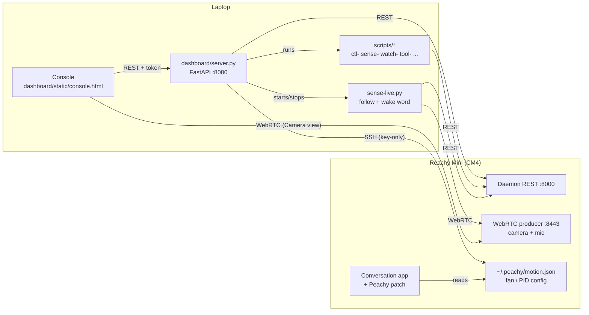

<p align="center"></p>

# Peachy

A desktop console and a set of small tools for a **Reachy Mini Wireless** robot
("Peachy"). Everything runs on a laptop on the same LAN as the robot and talks
to the robot's own daemon — no cloud relay, no Hugging Face login.

This file is the only documentation in the repo. It describes the current
architecture, the console, the robot-side setup, and the rules learned the
hard way.

---

## Architecture



Three channels, each with one job:

| Channel | Used for | Code |
|---|---|---|
| **Daemon REST** `http://<robot>:8000/api/...` | All motion, state, sound playback, volume, app lifecycle | every `ctl-`/`watch-`/`sense-` script, `server.py` |
| **WebRTC** `ws://<robot>:8443` | Camera frames and mic audio (receive-only) | `scripts/rtcmedia.py`, `dashboard/static/rtc.js` |
| **SSH** `<user>@<robot>` (key-only) | Robot-side config only: fan trip point, turntable PID, conversation-app patch, idle-motion settings | `scripts/robotssh.py` |

The console never duplicates logic: every button calls a script or the daemon,
so the scripts stay the single source of truth.

### Repo layout

```
run.sh                  start the console (→ dashboard/run.sh)
peachy                  terminal menu (fallback to the console)
requirements.txt
dashboard/
  server.py             FastAPI backend: /api/* for the console
  run.sh                launcher (token, port, QR, pid file)
  static/console.html   the console (single page, inline CSS/JS)
  static/rtc.js         WebRTC camera client
  static/viz3d/         live 3D twin (three.js + URDF)
  conversation_patch/   peachy_patch.py, installed on the robot by app-patch.sh
  voice_catalog.py, personality_catalog.py, gradio_panel.py (optional)
scripts/                tag-verb tools + importable libs (see Script map)
sounds/portalturret/    short cue clips played on state changes
assets/                 logo sources
tests/                  motion checks against a daemon (real or --sim)
.run/                   runtime state + secrets (git-ignored)
```

---

## Quick start

```bash
python3.12 -m venv reachy_mini_env
source reachy_mini_env/bin/activate
pip install -r requirements.txt

./scripts/net-connect.sh          # find the robot on the LAN, cache it
python scripts/ctl-toggle.py calibrate   # once: record this robot's sleep/wake poses
./run.sh                          # console at http://localhost:8080
```

- `./run.sh` prints a tokenized URL (`?k=<token>`). Open it once; a 90-day
  cookie is set. The token lives in `.run/peachy_token`.
- `./run.sh --restart` replaces a running console; `--qr` prints a QR code.
- Scripts find the robot through `scripts/hostfind.py`:
  `REACHY_HOST` → `.run/reachy_host` cache → LAN probe. No `source` needed.
- If moves stop actuating after a power cycle ("Backend not running"):
  `./scripts/net-connect.sh --fix`, then wait ~45 s.

---

## The console

Single page, desktop layout, black/white liquid-glass style.

| Area | What it does |
|---|---|
| **Header** | Connection status, clocks, System sheet, Stop (abort everything), Shut down. |
| **Robot** | Asleep / Awake. State comes from `.run/reachy_toggle_state.json`. |
| **Room watch** | Start/stop `watch-room.py`, live light reading, "It's lit / It's dark" labels for tuning. |
| **Follow** | Switch for `sense-live.py --follow` (faces and voices). |
| **Health** | CPU temperature, fan, response time. |
| **Apps** | Installed daemon apps, start/stop; App store (install/remove). |
| **Centre** | Camera (WebRTC, with face boxes) or live 3D twin; below it the **body direction tape** (drag to turn, ±160°). |
| **Moves** | Peachy expressions, daemon emotions and dances, with search. |
| **Conversation** | Start/stop the conversation app, "Hey Reachy" wake-word switch, personality, voice, mute mic, live transcript. |
| **Speaker** | Volume + test, and "type text → Play": `ctl-say.py` speaks it on the robot. |
| **Activity** | Action log (`/api/log`, 200-entry ring buffer), copyable. |
| **System** (sheet) | Head position on wake, light detection tuning, conversation-app idle motion (Breathing, Calmness), portal turret clips, cooling fan, diagnostics. |

Body turn is shown and entered **clockwise-positive** (seen from above). The
robot is counter-clockwise-positive; `/api/body*` does the flip.

### Console API (`dashboard/server.py`)

All routes require the token (cookie, `?k=`, or `X-Peachy-Token` header).

| Area | Routes |
|---|---|
| State | `GET /api/status`, `GET /api/log`, `POST /api/abort`, `POST /api/shutdown` |
| Sleep/wake | `POST /api/do/{wake\|sleep\|toggle}` |
| Head | `GET /api/head`, `POST /api/head/{move,save,capture,zero}` |
| Body | `GET /api/body`, `POST /api/body/yaw`, `POST /api/body/diag` |
| Moves | `POST /api/express/{name}`, `GET /api/moves`, `POST /api/moves/play` |
| Speaker | `POST /api/say`, `POST /api/sound/stop`, `GET/POST /api/volume`, `POST /api/volume/test`, `GET /api/sounds/turret`, `POST /api/sounds/turret/sync` |
| Conversation | `GET/POST /api/converse/idle-motion`, `.../voices[/current\|/apply]`, `.../personalities[/apply]` |
| Apps | `GET /api/apps`, `GET /api/apps/store`, `POST /api/apps/{install,stop}`, `POST /api/apps/{start,remove}/{name}`, `GET /api/apps/job/{id}` |
| Senses | `GET /api/sense`, `GET /api/sense/gate`, `POST /api/sense/{follow\|wake}/{on\|off}` |
| Room watch | `POST /api/roomwatch/{start\|stop}`, `GET /api/roomwatch/status`, `POST /api/roomwatch/confirm`, `POST /api/roomwatch/history/clear` |
| Light | `GET /api/light`, `GET /api/light/lab`, `POST /api/light/lab/capture/{label}`, `GET /api/light/lab/compare`, `POST /api/light/lab/tune` |
| Fan | `GET /api/fan`, `POST /api/fan/{calm,steady,restore}` |
| Camera | `POST /api/snap` (one frame over WebRTC) |

---

## Senses

### Follow and wake word — `scripts/sense-live.py`

Runs on the laptop, fed by one WebRTC stream (video + mic).

- **Follow**: tracks the nearest face (daemon-side tracking on firmware 1.11+,
  else local detection); prefers whoever is talking (mic direction of arrival);
  turns the body toward a voice when nobody is in view.
- **Wake word** ("Hey Reachy" / "Hey Peachy"): faster-whisper `base.en`
  (`PEACHY_WAKE_MODEL`, cached under `.run/models/`). Starts the conversation
  app through the console.

The wake word is guarded against Peachy hearing itself:

1. **Gate.** It only listens when nothing owns the robot (no console action,
   conversation or app per `/api/sense/gate`, no running move) and the speaker is idle
   (`speaking` is false — set by `/api/say`, volume tests and cue clips). After
   any of those ends it needs 4 s of quiet, and the buffered audio is dropped.
2. **Two-pass confirmation.** Whisper tends to echo its `initial_prompt` on
   unclear audio, so a prompted hit must be confirmed by an unprompted pass
   that starts with a greeting word.
3. **No bypass.** If the console declines the wake (HTTP error, e.g. busy), it
   does not wake. Only when the console is unreachable does it start directly.

### Room watch — `scripts/watch-room.py`

State machine driven by room brightness (from Peachy's head camera, via
`light_sensor.py`) and the daemon's `speech_detected` flag:

- `RESTING` — dark/quiet, relaxed pose
- `SEMI_WAKE` — lights on, peeks up
- `AWAKE` — someone spoke: full wake, greeting, hand-off to the conversation app;
  back to rest when the room empties
- `DEEP_SLEEP` — outside active hours (`REACHY_NIGHT_START` 22:00 →
  `REACHY_NIGHT_END` 07:30)

Always try `--dry-run` first (sensors only, no movement). Poses are
interpolated between the calibrated sleep/wake poses.

---

## Robot-side setup (over SSH)

The login user is read from `REACHY_SSH_USER` or `.run/ssh_user` (never
committed). The robot must accept this laptop's key (passwordless sudo). The robot's
OpenSSH penalises failed logins and then refuses every connection for minutes,
so:

- never script password logins;
- always go through `robotssh.ssh_run` / `ssh_argv`. The first auth rejection
  opens a 10-minute breaker (`.run/ssh_block`). Reset:
  `python -c 'import sys; sys.path.insert(0,"scripts"); import robotssh; robotssh.clear_block()'`

| Tool | What it changes | Survives |
|---|---|---|
| `scripts/tool-body-pid.sh apply` | Turntable PID 200/0/0 → 300/50/0 (stock stops 10–15° short). Needs a full `systemctl restart`; REST `/api/daemon/restart` does not reload it. | Reverted by a daemon/firmware update — re-apply |
| `scripts/app-patch.sh apply` | Installs `peachy_patch.py` into the conversation app: holds the body yaw from `~/.peachy/motion.json` (the stock app streams body=0° at 100 Hz), scales breathing, sets the idle-behaviour interval. `set breath_scale=… idle_every_s=… body_yaw_deg=…` edits the settings. | Reverted by an app update — re-apply |
| `scripts/tool-fan.sh` | CM4 fan trip point (calm / steady / restore). | — |

Without the app patch, a body turn from the console has to stop the
conversation app first.

---

## Script map

Filenames are `tag-verb`, so `ls scripts/` groups itself.

| Tag | Scripts | Purpose |
|---|---|---|
| `ctl-` | `ctl-toggle.py` (sleep / wake / toggle / calibrate / status), `ctl-express.py` (expressions: yes, no, curious, lookaround, excited, shy, stretch), `ctl-say.py` (text → macOS `say` → robot speaker), `ctl-body-yaw.py` (body-yaw test CLI) | direct control |
| `watch-` | `watch-room.py` | room-aware state machine |
| `sense-` | `sense-live.py` | follow + wake word |
| `cam-` | `cam-snap.py` | one camera frame over WebRTC (`--open`) |
| `cal-` | `cal-head.py` | neutral head offset (type `save` in the REPL or it doesn't persist) |
| `diag-` | `diag-yaw.py`, `diag-panel.py` | turntable diagnostic; pre-session smoke test |
| `net-` | `net-connect.sh` | find / revive the robot over REST |
| `app-` | `app-conversation.sh`, `app-patch.sh` | conversation-app lifecycle and patch |
| `tool-` | `tool-body-pid.sh`, `tool-fan.sh`, `tool-qr.py`, `tool-print-links.py`, `tool-stop-all.sh` | robot-side tuning, links, emergency stop |
| lib | `hostfind.py`, `robotssh.py`, `rtcmedia.py`, `sound_sync.py`, `head_pose.py`, `motion_ready.py`, `sleep_gentle.py`, `warmup_bridge.py`, `spoken_line.py`, `fan_read.py`, `light_sensor.py`, `light_lab.py`, `light_probe.py` | imported by the scripts above — keep importable |

`rtcmedia.py`: one stream per process — each consumer costs the robot an encoder.

---

## Rules learned the hard way

1. **Enable motors before any move.** `play/wake_up`, `goto_sleep` and `goto`
   are silent no-ops while `motor_control_mode` is `disabled`:
   `POST /api/motors/set_mode/enabled` first.
2. **`play/*` moves are asynchronous.** They return a UUID immediately; poll
   `GET /api/move/running` before issuing the next move.
3. **No camera over REST.** Frames and mic come from the WebRTC producer.
4. **Motors-disabled pose is ambiguous** (the head flops under gravity), so
   sleep/wake state lives in `.run/reachy_toggle_state.json`, not in the pose.
5. **Sleep is a tradeoff** (`REACHY_SLEEP_MODE`): `gravcomp` (default) holds
   the pose with a faint hum; `limp` is silent but the head relaxes and the
   antennae rise; `hold` is firmest and loudest.
6. **The whine is the CM4 cooling fan**, not the motors.
7. **Body yaw sign.** Robot/SDK/`goto` are counter-clockwise-positive
   (+ = Peachy's left). The console is clockwise-positive; don't flip twice.
8. **Network.** The school Fortinet intercepts TLS and breaks Tailscale, so
   `tailscaled` is disabled on the robot. Everything needed runs on the LAN.

---

## Daemon REST cheat sheet

Swagger at `http://<robot>:8000/docs`. Units: metres and radians.

- **Motors**: `POST /api/motors/set_mode/{enabled|disabled|gravity_compensation}`, `GET /api/motors/status`
- **State**: `GET /api/state/full` (head pose, body yaw, antennas, control mode, doa), `GET /api/state/doa` (`angle`, `speech_detected`), `ws://<robot>:8000/api/state/ws/full`
- **Move**: `POST /api/move/play/{wake_up|goto_sleep}`, `POST /api/move/goto`
  `{"head_pose":{x,y,z,roll,pitch,yaw}, "antennas":[l,r], "body_yaw":0, "duration":1.2, "interpolation":"minjerk"}`
  (`duration` required; omitted fields hold), `POST /api/move/set_target` (high-rate), `POST /api/move/stop`, `GET /api/move/running`
- **Media**: `POST /api/media/play_sound` · `stop_sound`, `POST /api/media/sounds/upload`, `DELETE /api/media/sounds/{file}`, `GET/POST /api/volume`
- **Apps**: `GET /api/apps/list-available/installed`, `GET /api/apps/current-app-status`, `POST /api/apps/install`, `POST /api/apps/start-app/{name}`, `POST /api/apps/stop-current-app`, `POST /api/apps/remove/{name}`, `GET /api/apps/job-status/{id}`
- **Daemon**: `POST /api/daemon/restart`

Safety clamps enforced by the daemon: head pitch/roll ±40°, head yaw ±180°,
body yaw ±160°, head-vs-body yaw ≤ 65°.

---

## Configuration

Set in the environment or `.run/reachy.env` (written by `net-connect.sh`).

| Variable | Default | Meaning |
|---|---|---|
| `REACHY_HOST` / `REACHY_PORT` | auto / `8000` | robot daemon |
| `PEACHY_PORT` | `8080` | console port |
| `PEACHY_TOKEN` | `.run/peachy_token` | console access token |
| `REACHY_SLEEP_MODE` | `gravcomp` | `gravcomp` / `limp` / `hold` |
| `PEACHY_WAKE_MODEL` | `base.en` | faster-whisper model for the wake word |
| `PEACHY_CONVO_APP` | `reachy_mini_conversation_app` | app started on wake |
| `PEACHY_TURRET_CUES` | `1` | play turret clips on state changes |
| `REACHY_NIGHT_START` / `REACHY_NIGHT_END` | `22:00` / `07:30` | room-watch deep-sleep window |

`.run/` holds the token, calibration, host cache, logs and models. It is
git-ignored and must never be shared.

---

## Roadmap (v2)

1. **Finish Room watch.** Make `watch-room.py` dependable end to end: light
   thresholds that hold across daylight and shades, clean hand-off to and from
   the conversation app, sleep when the room empties.
2. **Click to aim.** Click anywhere in the camera view and Peachy turns its body
   and head to centre that point. The pixel becomes a bearing through the
   camera intrinsics (`GET /api/camera/specs` → `K`); yaw is split between body
   and head within the head-vs-body limit (≤ 65°), pitch goes to the head.
3. **3D room capture.** The robot has a single camera (the other "eye" is
   cosmetic), so depth has to come from motion: sweep the head/body through
   known poses (the kinematics give the camera pose for every frame), then fuse
   the frames with monocular depth estimation or structure-from-motion into a
   point cloud or panorama, shown in the console's 3D view.

---

## Extending

- `tag-verb` filenames; resolve the robot with `from hostfind import resolve_host`.
- REST for motion/state, `rtcmedia.py` for camera/audio, `robotssh` for
  robot-side config only.
- Enable motors before moving; wait for `play/*` moves to finish.
- Give anything autonomous a `--dry-run`.
- New console features call a script or the daemon; don't duplicate logic in
  `server.py`.
